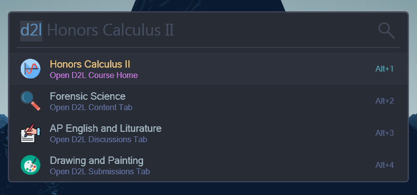
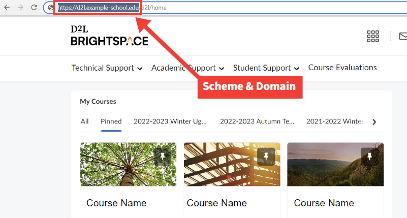
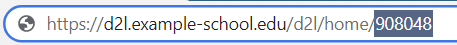
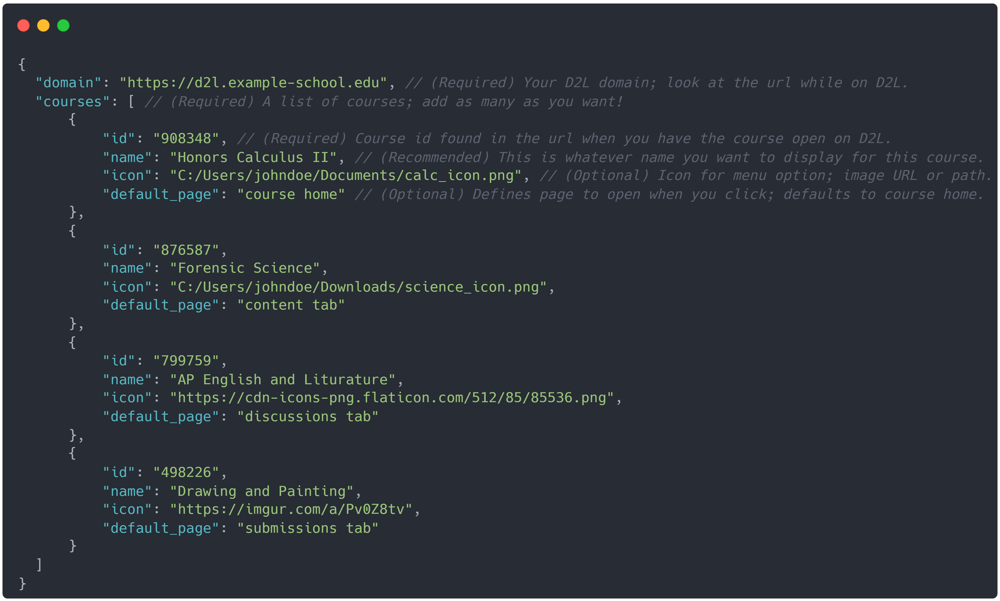
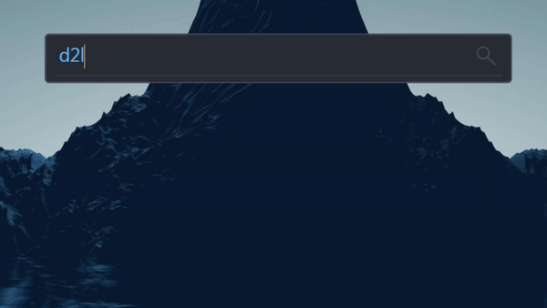

# D2L Course Launcher

This is a plugin for [Flow Launcher](https://www.flowlauncher.com) to help students using the D2L (Desire to Learn) Brightspace LMS. This plugin will allow you to quickly open any of your course pages in the browser all from Flow Launcher. 

Because D2L is slightly diffrent for each school, and because it has no way for and outside application to automatically request your courses, this means that there will be some manual set up to get this working. If your tech savvy then it should be fine, but I've tried to make the guide below as straight forward as possible so more people can use this. You will need to manually update your courses when you start new ones.




> **Warning**
> This plugin is in the early stages of development so there may be some issues. Feel free to submit an issue on this github if you find any :)


# Instructions
First, you will need to create a configuration file called **`Configuration.json`** in the folder:

```C:/Users/%USERPROFILE%/AppData/Roaming/FlowLauncher/Settings/Plugins/D2L Course Launcher```

In this file you will be configuring some data about the classes you want to show in flow launcher. 

You can copy and paste the contents of this **[Blank Configuration Template](#blank-configuration-template)**  into your new `Configuration.json` to get you started.

**Finding the Domain:**

Open D2l in your browser like normal, then look at the url. You want to copy the protocol (https:// or http://), any subdomains, and the main domain (example.com). **Basically everything up to the forward slash path part after the domain.**

After you have the domain, input this into your **`Configuration.json`** file under the domain field.



**Finding Course IDs:**

Open the D2L course in your browser like normal, then look in the url for something that looks like an id. This will most likely be a series of numbers.

You will need to find the ID for each of the courses you want in your launcher. When you have the IDs, you can put them in the id fields of your **`Configuration.json`** file.


> **Note**
> Now it's up to you to decide if and how you want to fill out the rest of the fields. Check out the example configuration below, and the detailed parameter description chart.

## **Sample Configuration**

[](https://github.com/Navnedia/D2L-Course-Launcher/blob/main/Blank-Configuration.json)

## **Configuration Parameters**
|   Parameter  |     Type     | Description                          |
|:------------:|:------------:|:-------------------------------------|
| domain       |   Required   | Your schools D2L domain: `https://d2l.example-school.com` It won't look exactly like that. Just look at the url while on D2L **(See image below)**. |
| courses      |   Required   | A list of courses. Add as many as you want! |


**Per Course Parameters**
|   Parameter  |     Type     | Description                          |
|:------------:|:------------:|:-------------------------------------|
| id           |   Required   | Course id can be found in the url when you have the course open on D2L. Likely a series of numbers. |
| name         |  Recommended | This is whatever custom name you want to display for this course. Default is the course id. |
| icon         |   Optional   | The icon for the course menu option. This can be a local `file path`, or an `online image url`. **MAKE SURE TO USE FORWARD SLASHES FOR FILE PATHS!!** |
| default_page |   Optional   | Page that opens when the course is clicked. **(Options: `course home`, `content tab`, `discussions tab`, `submissions tab`)** Default is course home. |


## Using the Plugin
Once configured, you can now type the `d2l` keyword into flow launcher to see your course options. Select any of the course options to open the default course page in your browser. 

Pressing `Shift+Enter` on any of the courses will launch a context menu with additional options to open diffrent D2L tabs for the course including: 

Course Home, Content, Discussions, and Submissions.

**Demo**




# Blank Configuration Template
See the documentation **[Instructions](#instructions)** to help you get started with the template below:

```json
{
    "domain": "",
    "courses": [
        {
            "id": "",
            "name": "",
            "icon": "",
            "default_page": ""
        },
        {
            "id": "",
            "name": "",
            "icon": "",
            "default_page": ""
        },
        {
            "id": "",
            "name": "",
            "icon": "",
            "default_page": ""
        },
        {
            "id": "",
            "name": "",
            "icon": "",
            "default_page": ""
        }
    ]
}